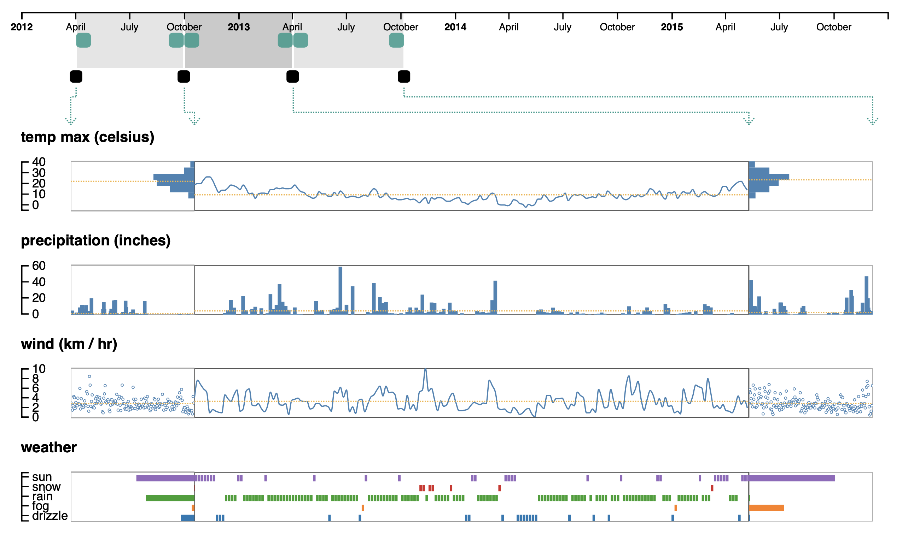

# Periphery Plots

Patterns in temporal data are often across different scales, such as days, weeks, and months, making effective visualization of time-based data challenging. _Periphery Plots_ are a new approach for providing focus and context in time-based charts to enable interpretation of patterns across heterogeneous time scales. Our approach employs a focus zone with a time axis and a second axis, that can either represent quantities or categories, as well as a set of adjacent periphery plots that aggregate data along the time dimension, value dimension, or both. This repository contains a prototype implementation of Periphery Plots as a React component as well as demo of the technique.

## Running the Demo

This implementation requires the latest version of [NodeJS](https://nodejs.org/en/) to install package dependencies and to run the demo.

  1. Clone the repo.
  1. Enter the directory `PeripheryPlots`.
  1. Install package dependencies by running `npm install`.
  1. Build and launch the app via `npm start`.
  1. Open _http://localhost:8080_ in your web browser.

## Preprint

A preprint describing the periphery plot data visualization approach in detail is available on arxiv: https://arxiv.org/abs/1906.07637.

Winner of the **Best Short Paper award at IEEE VIS 2019**. 

## Component Configuration 

The PeripheryPlots React component takes a single configuration object as input. Properties that are __bolded__ are required while all others are optional with sensible defaults. The React based [prop-types](https://www.npmjs.com/package/prop-types) library is used to validate the configuration object.  

| Property  | Type | Description |
| ------------- | ------------- | ------------- |
| __`trackwiseObservations`__ | [ [ Object, ... ], ... ] | The set of temporal observations for each track. |
| __`trackwiseTimeKeys`__ | [ String, ... ] | Key used to index temporal attribute from observation objects. |
| __`trackwiseValueKeys`__ | [ String, ... ] | Key used to index value attribute from observation objects.  |
| __`trackwiseTypes`__ | [ String, ... ] | Data type for each track. Can be "continuous",  "discrete", or "other". |
| __`trackwiseUnits`__ | [ String OR Null, ... ] | Unit for each track. |
| __`trackwiseNumAxisTicks`__ | [ Integer OR Null, ... ] | The number of ticks for each track axis. |
| __`trackwiseAxisTickFormatters`__ | [ d3.format OR Null, ... ] | Tick formatter for each track axis. |
| __`trackwiseEncodings`__ | [ [ [ React.Component, ... ], ... ] ... ] | Layered encoding specification for each track. |
| __`applyEncodingsUniformly`__ | Boolean | Determines the number of encoding specifications required for each track. |
| `contextWidthRatio` | Float in range [0.0, 1.0]   **default:** .2 | Fraction of available space (whithin tracks) allocated to each context plot. |
| `numContextsPerSide` | Integer+   **default:** 1 | The number of context zones on each side of the focus zone. |
| __`timeExtentDomain`__ | [ Date, Date ] | A temporal range including all data observations across all data sources. |
| __`timeDomains`__ | [ [ Date, Date ], ... ] | Temporal ranges corresponding to initially selected brush regions for the control timeline. |
| __`tickInterval`__ | d3.CountableTimeInterval | The interval for tick placement for the control timeline axis. |
| `dZoom` | Integer+   **default:** 5 | Speed of track generated zoom events for control timeline. |
| `containerBackgroundColor` | Valid input to d3.color constructor   **default:** "#ffffff" | Background color for the component container. |
| `focusColor` | Valid input to d3.color constructor   **default:** "#576369" | Color of focus brush and focus plot borders. |
| `contextColor` | Valid input to d3.color constructor   **default:** "#9BB1BA" | Color of context brush and context plot borders.|
| `lockActiveColor` | Valid input to d3.color constructor   **default:** "#00496E" | Color of control timeline locks when active. |
| `lockInactiveColor` | Valid input to d3.color constructor   **default:** "Grey" | Color of control timeline locks when inactive. |
| `containerPadding` | Integer+   **default:** 10 | Component padding in pixels that surrounds tracks and control timeline. |
| `controlTimelineHeight` | Integer+   **default:** 50 | The height of the control timeline in pixels. |
| `verticalAlignerHeight` | Integer+   **default:** 30 | The height of the vertical alignment component in pixels. |
| `axesWidth` | Integer+   **default:** 40 | The width of the axis for each track in pixels. |
| `trackHeight` | Integer+   **default:** 50 | The width of each track in pixels. |
| `trackSvgOffsetTop` | Integer+   **default:** 10 | The offset from top of svg plot containers defining top bound on drawable space. |
| `trackSvgOffsetBottom` | Integer+   **default:** 5 | The offset from bottom of svg plot containers defining bottom bound on drawable space. |

Some of the descriptions in the table above are sufficient, but some properties are more complex and must satisfy specific criteria to be considered valid.

We describe these properties in further detail as they relate to the two core subcomponents of the PeripheryPlot framework: 

* Tracks 
* Control Timeline 

### Tracks 

Tracks are vertically aligned containers that house multiple focus and context plots. The plots are horizontally organized along the temporal axis. The focus plot is always in the middle and there are an equal number of context plots on both sides of the focus plot. 

All properties that begin with the word 'trackwise' are arrays and they must have equal lengths. The *ith* value in each of these arrays corresponds to some property for the *ith* track. 

*`trackwiseObservations`* 
> Each individual set of observations is an array of objects. Each object is a temporal observation with a temporal attribute and one or more value attributes. 

*`trackwiseTypes`*
> We broadly group data into three classes:
 * Continuous (assumed to be numeric)
 * Discrete (can be numeric or of some other form)
 * Other
> These enumerative types are used to determine what type of axis is used for each track. 

*`trackwiseUnits`* 
> If specified, the unit is displayed alongside the track name (or rather, the valueKey used to index observations). 

*`trackwiseEncodings`* 
> For each track we specify a collection of encoding schemas. The dimensions of `trackwiseEncodings` is determined by `applyContextEncodingsUniformly` and `numContextsPerSide`. 
> * if `applyContextEncodingsUniformly` === true: 
>   * `trackwiseEncodings[i]` is of the form:
>   [   &nbsp; &nbsp; [ /\* encoding schema to be applied to all left contexts plots \*/ ],   &nbsp; &nbsp; [ /\* encoding schema for focus plot \*/ ],   &nbsp; &nbsp; [ /\* encoding schema to be applied to all right contexts plots \*/ ]   ]
> * if `applyContextEncodingsUniformly` === false:
>   * `trackwiseEncodings[i]` is of the form:   [   &nbsp; &nbsp; [ /\* encoding schema to be applied to the `1st` left context plot \*/ ],   &nbsp; &nbsp; ...   &nbsp; &nbsp; [ /\* encoding schema to be applied to the `numContextsPerSide-th` left context plot \*/ ],   &nbsp; &nbsp; [ /\* encoding schema for focus plot \*/ ],   &nbsp; &nbsp; [ /\* encoding schema to be applied to the `1st` right context plot \*/ ],   &nbsp; &nbsp; ...   &nbsp; &nbsp; [ /\* encoding schema to be applied to the `numContextsPerSide-th` right context plot \*/ ]   ]
>
> Each encoding schema, represented by `trackwiseEncodings[i][j]` is an array where each element is a React.Component (can be class, function, or any other kind). Each possible value of `trackwiseEncodings[i][j]` is bound to some plot within the interface (as described above). After this binding occurs, the elements of `trackwiseEncodings[i][j]` are rendered into the plot (svg) they are bound to in the order they are specified. 
> * ex: if `trackwiseEncodings[i][j]` = [BarChart, AverageLine], then some plot within some track will be populated with a bar chart visualization with an average line annotation layered over top. You can see an example of this in the 'precipitation' track in the .gif demo at the top of this page. 

### Control Timeline

The control timeline is a set of multiple linked brushes which allow users to dynamically configure focus and context zones, temporal regions to be viewed and summarized at varying visual resolutions. 

The ith brush (from left to right) in the control timeline determines the temporal period bound to the ith subplot (from left to right) across all tracks in the interface. 

*`timeExtentDomain`*
> A temporal range containing all points. This should almost always be as small as possible, so there is no temporal subrange for which there is no data. 

*`timeDomains`*
> The initial temporal ranges of analysis. There should be `(numContextsPerSide * 2) + 1` timeDomains specified. There should be no temporal distance between two adjacent temporal ranges (i.e. where `timeDomains[i]` ends, `timeDomains[i+1]` should begin). 